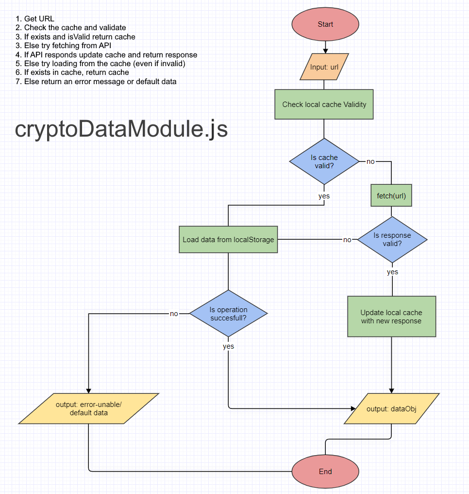
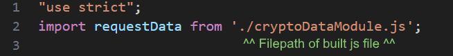
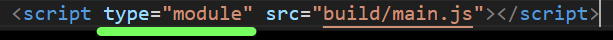

# cryptoDataModule.js
Data module for Crypto website project (John Bryce Project no.2)
More in-depth documentation (in English) in "/documentation/README_FULL.pdf"

<h1>התקנה ושימוש</h1>
כדי להתקין את המודול יש להעתיק cryptoDataModule.js לתיקיית הפרויקט שלכם או לתיקייה משנית בפרוייקט. לאחר מכן יש לבצע אימפורט למודול לקובץ הmain הראשי שלכם כמו שמופיע להלן:

יש לבצע את ההתאמות הנדרשות בתגית הscript הראשית בקוד HTML שלכם:

כדי להשתמש במודול עליכם לקרוא לפונקציית requestData שסופקה על ידי המודול. הפונקציה requestData מקבלת שני פרמטרים: url (מחרוזת) וignoreCache (בוליאן) (אופציונלי). הנה דוגמה לשימוש במודול:

בדוגמה שמוצגת לעיל, נקראת פונקציית requestData עם קישור API כפרמטר הראשון. היא מבצעת fetch מה-API ומחזירה את התגובה כאובייקט JSON. אם הבקשה הוצלחה, הנתונים שנקבלו מודפסים לקונסול. אם מתרחשת שגיאה במהלך הבקשה או בשליפת הנתונים מהמאגר, הודעת שגיאה מודפסת לקונסול. "

